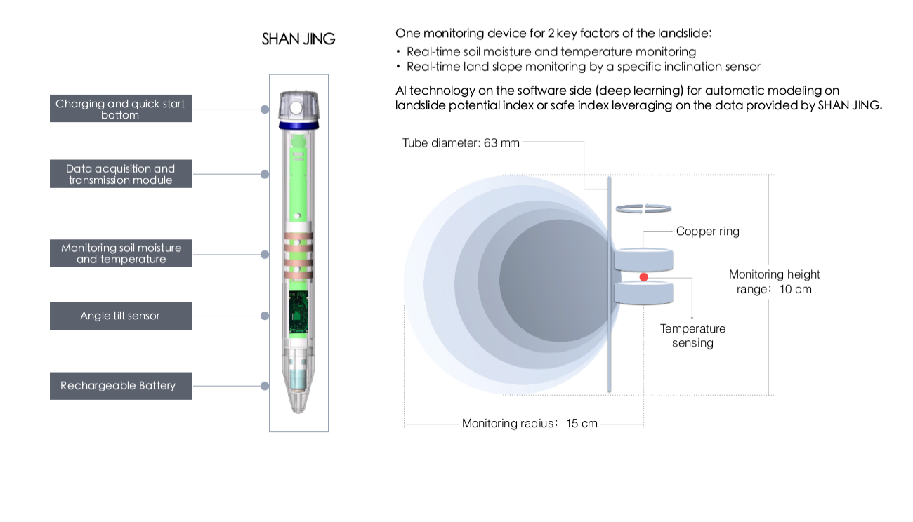
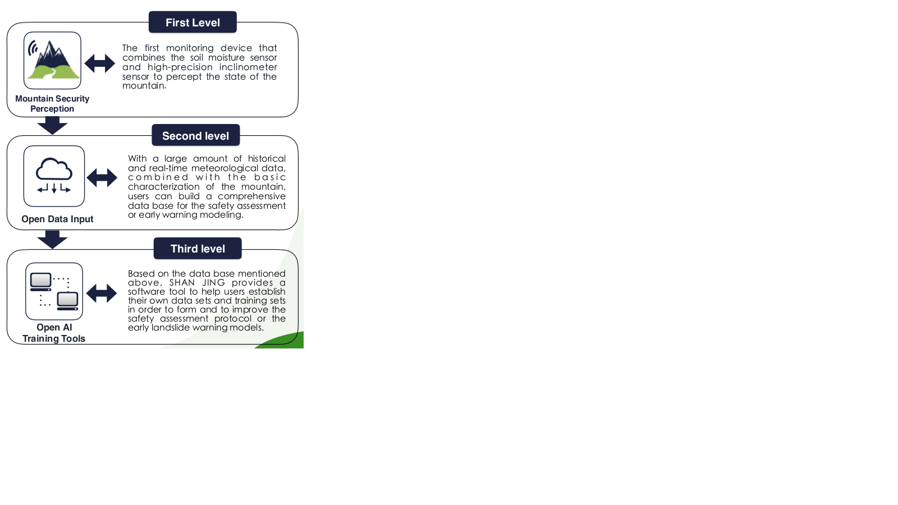
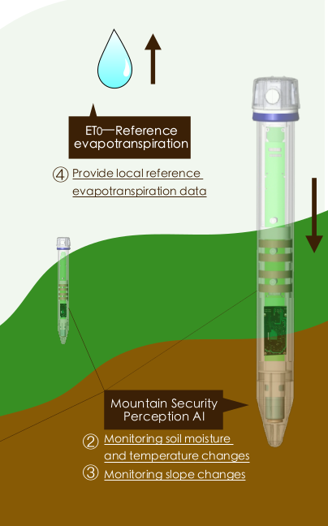

# My_Call_For_Code_Pro
A project wish to explore the relationship between moisture and slope that can be helpful to Landslides disaster

## 1.About The Sensor
The sensor just like a pole insert into the soil.
The sensor use embeded controler to monitor the parameters around the slope.
It can return some information about soil and simple enviroment parameters around,for example moisture, tilt or temperature.
Following pictures introduce some information about the sensor:

 

## 2.About The Software 
### (1)Download the whole project
   `wget https://github.com/wk821917/My_Call_For_Code_Pro/archive/master.zip`

### (2)Unzip the zipfile
   `unzip -o -d ./ master.zip`

