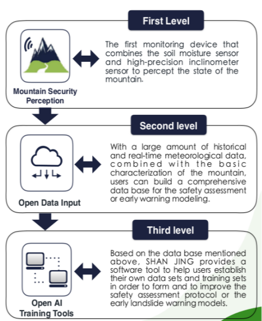

# My_Call_For_Code_Pro
A project wish to explore the relationship between moisture and slope that can be helpful to Landslides disaster

## 1.About The Sensor
The sensor just like a pole insert into the soil.
The sensor use embeded controler to monitor the parameters around the slope.
It can return some information about soil and simple enviroment parameters around,for example moisture, tilt or temperature.
Following pictures introduce some information about the sensor:

 

## 2.About The Software 
### (1)Download the whole project
   `wget https://github.com/wk821917/My_Call_For_Code_Pro/archive/master.zip`

### (2)Unzip the zipfile
   `unzip -o -d ./ master.zip`

### (3)Run the Create_model script
     1.You can run the 'Create_model.ipynb' by jupyter notebook with python3.5 kernal  
     2.You can also run the script by watson stdio service, the service provide python3.5 kernal  
     3.The script not only create model and weight file but also made a test with a picture  named'pred_act.png' output,
       the model file and weight file will save in the cloud-object-storage.   You can find the logfile and the picture in the
       current dir
     
